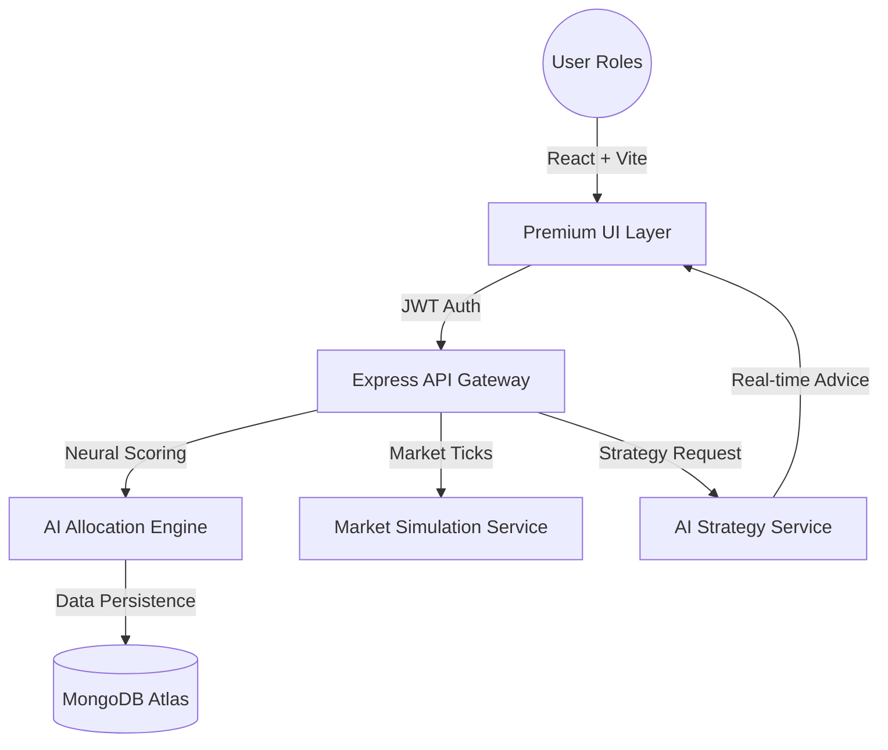

# AllocateIQ - Advanced AI Trading Ecosystem

AllocateIQ is an enterprise-grade, full-stack trading and allocation platform. It bridges the gap between retail investors and professional trading expertise by leveraging a neural matching engine and real-time AI advisory nodes.

---

## 📐 Platform Architecture



---

## 🚀 Core Modules

### 🖥️ 1. Customer Intelligence Portal
The primary interface for retail investors, designed for high-end usability and rapid decision support.
- **AI Strategy Advisor**: Real-time integration with a **Proprietary Neural Engine**. Receive complex market analysis, "Buy/Hold/Sell" recommendations, and risk-adjusted entry strategies.
- **Paper Trading Engine**: Execute orders on a zero-risk simulated market. Track your net worth, available liquidity, and profit margins through a glassmorphic command center.
- **Dynamic Profile DNA**: Customers define their risk appetite and financial goals, which are used as vector inputs for the platform's trader-matching logic.
- **Instant Service Feedback**: Rate your assigned trader's performance (1-5 stars). The system uses this feedback to re-calculate trader "Success Scores" in real-time.

### 🧑‍💼 2. Professional Trader (Employee) Suite
A high-density terminal for professionals to manage their assigned client portfolios.
- **Global Market Intelligence**: A live feed of assets (BTC, ETH, Stocks) with simulated price action updated via a dedicated backend ticker service.
- **Performance Analytics**: Track personal growth via automated success-rate metrics, avg customer satisfaction, and platform-wide ranking.
- **Execution History**: A detailed audit of all trades performed for every client, featuring advanced filtering and profit/loss analysis.
- **Workload Management**: Automated indicators showing the trader's current client load vs. maximum capacity.

### 🏛️ 3. Admin Command & Control
Total oversight of the ecosystem's health and security.
- **AI Assignment Dashboard**: Monitor the neural engine as it pairs "High Risk" clients with "Expert" traders. Manual overrides and engine reruns available with one click.
- **Platform Health & Logs**: A live terminal console tracking every INFO, WARN, and ERROR event across the API and Database clusters.
- **Immutable Security Audit**: Every administrative action (weight changes, user deletions, role upgrades) is logged in a secure, immutable audit trail.
- **Global Settings Control**: Adjust the platform's core physics—change AI allocation intervals, success-rate thresholds, and security compliance rules.

---

## 🎨 Design System: "Premium App-First"
AllocateIQ departs from traditional flat web designs by utilizing:
- **Unified Sidebar Navigation**: A single collapsible rail for both public and private routes, ensuring a focused workspace.
- **Glassmorphism**: High-blur backdrops, subtle gradients, and translucent borders (CSS `backdrop-blur`).
- **Interactive Micro-animations**: State-aware hover effects, pulse indicators for "Live" data, and smooth transition-timing functions.
- **Dark-Mode Optimized**: A curated HSL color palette designed for high-contrast visibility in trading environments.

---

## 🔒 Security & Tech Stack

### Frontend
- **React 18**: Component-based architecture with context-driven state management.
- **Vite**: Ultra-fast HMR and build pipelines.
- **Lucide Icons**: Consistent, high-fidelity iconography.
- **Tailwind CSS**: Utility-first styling with custom animation extensions.

### Backend
- **Node.js & Express**: Scalable RESTful architecture.
- **MongoDB + Mongoose**: Document-oriented data modeling with strict schema validation.
- **JWT + Bcrypt**: Secure token-based auth with salted password hashing.
- **Concurrently**: Unified development lifecycle management.

### AI Node
- **Proprietary Neural Engine**: High-parameter LLM integration via OpenRouter for context-aware strategy generation and trader matching.

---

## 🏃 Getting Started

### 1. Environment Configuration
Create a `.env` file in the `server/` directory:
```env
PORT=5000
NODE_ENV=development
DB_URI=your_mongodb_connection_string
JWT_SECRET=your_jwt_secret
OPENROUTER_API_KEY=your_openrouter_api_key
```

### 2. Rapid Installation
```bash
# From the root directory
npm install
```

### 3. Execution
```bash
# Start both Frontend and Backend concurrently
npm run dev
```

---

## 🗺️ Roadmap
- [ ] **Live Payout Integration**: Integration with Stripe for real-money commissions.
- [ ] **Mobile Trading App**: React Native port for on-the-go allocation management.
- [ ] **Vector Search for Matching**: Upgrade the AI engine to use Pinecone/Milvus for even more precise trader-customer pairing.

---

## 📄 License
This platform is licensed under the **MIT License**.
