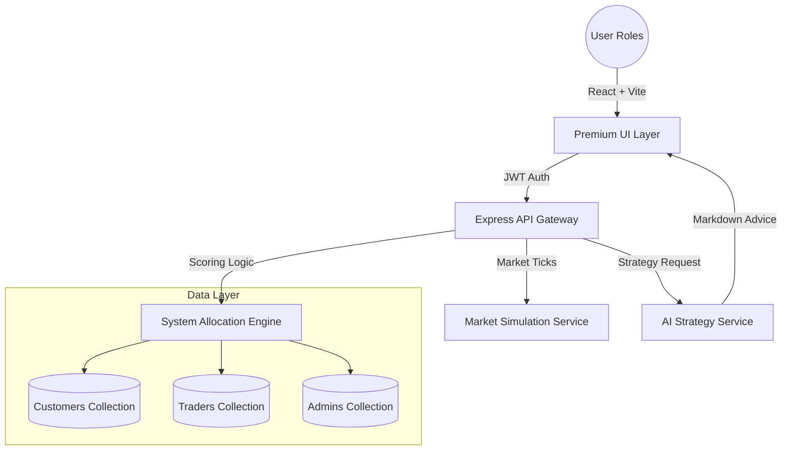

# Trade AI - Advanced System Trading Ecosystem

Trade AI is an enterprise-grade, full-stack trading and allocation platform. It bridges the gap between retail investors and professional trading expertise by leveraging a proprietary **System Engine** and real-time AI advisory nodes.

---

## 📐 Platform Architecture



---

## 🚀 Core Modules

### 🖥️ 1. Customer Intelligence Portal
The primary interface for retail investors, designed for high-end usability and rapid decision support.
- **AI Strategy Advisor**: Real-time integration with a **Proprietary System Engine**. Receive complex market analysis and strategy recommendations in rich **Markdown** format.
- **Paper Trading Engine**: Execute orders on a zero-risk simulated market. Track your net worth and profit margins through a glassmorphic command center.
- **Dynamic Profile DNA**: Customers define their Risk Appetite, Market Specialization, and Complexity requirements, which drive the matching logic.
- **Instant Service Feedback**: Rate your assigned trader's performance. The system uses this feedback to re-calculate trader "Success Scores" in real-time.
- **Google OAuth**: Fast, secure 1-click registration and login for retail investors.

### 🧑‍💼 2. Professional Trader (Employee) Suite
A high-density terminal for professionals to manage their assigned client portfolios.
- **Client DNA Visibility**: View detailed strategy requirements for assigned clients to provide tailored trading support.
- **Performance Analytics**: Track growth via automated success-rate metrics and platform-wide ranking.
- **Execution History**: A detailed audit of all trades performed for every client, featuring advanced filtering and P/L analysis.
- **Workload Management**: Automated indicators showing current client load vs. maximum capacity (System-enforced limits).

### 🏛️ 3. Admin Command & Control
Total oversight of the ecosystem's health and security.
- **System Assignment Engine**: Monitor the engine as it pairs "High Risk" clients with "Expert" traders. Manual overrides and "Dismiss" authority are built-in.
- **Live Global Trades**: A real-time feed of all operations happening across the platform for total transparency.
- **Split Collection Security**: Data is physically segregated into `admins`, `customers`, and `traders` collections for enhanced security and scalability.
- **Global Settings Control**: Adjust the platform's core physics—change allocation intervals, success-rate thresholds, and security compliance rules.

---

## 🎨 Design System: "Proprietary & Premium"
Trade AI utilizes a custom-built design system characterized by:
- **Zap Branding**: High-energy, professional aesthetic centered around the "Zap" (System) identity.
- **Glassmorphism**: High-blur backdrops, subtle gradients, and translucent borders.
- **Rich Markdown AI**: AI outputs are rendered as beautiful, formatted documents rather than simple text strings.
- **Dark-Mode Optimized**: A curated HSL color palette designed for high-contrast visibility.

---

## 🔒 Security & Tech Stack

### Frontend
- **React 19**: Modern component architecture with concurrent rendering support.
- **React Markdown**: Renders rich, formatted AI match reasoning and strategy advice.
- **Google OAuth Provider**: Integrated `@react-oauth/google` for seamless social sign-in.
- **Lucide Icons**: Consistent, high-fidelity iconography.
- **Tailwind CSS**: Utility-first styling with custom glassmorphic extensions.

### Backend
- **Node.js & Express**: Scalable RESTful architecture with unified error handling.
- **Multi-Collection MongoDB**: Scalable data model with segregated `admins`, `customers`, and `traders` collections.
- **JWT + Bcrypt**: Secure token-based auth with cross-collection identity verification.
- **Enhanced Middleware**: Granular authentication logic that distinguishes between `401 Unauthorized` (identity issues) and `403 Forbidden` (permission issues).
- **Google Auth Library**: Secure verification of Google ID tokens for seamless backend authentication.

### Recent Enhancements
- **Auth Robustness**: Integrated safety checks in the frontend to prevent redundant Google initialization and handle missing environment variables gracefully.
- **Advanced Error Logging**: Implemented server-side JWT verification logging for rapid debugging of authentication issues.
- **Role-Based Access Control (RBAC)**: Standardized admin-only routes using a unified `admin` middleware for consistent platform security.
- **Development Environment Polish**: Mitigated common development-time warnings related to React Strict Mode and Ad-blocker interference.

### AI Engine
- **System Engine**: High-parameter LLM integration via OpenRouter, delivering structured, context-aware financial strategy in Markdown.
- **Match Reasonings**: AI match logic that provides transparent explanations for trader-customer pairings.

---

## 🏃 Getting Started

### 1. Environment Configuration
Create a `.env` file in the `server/` directory:
```env
PORT=5000
NODE_ENV=development
DB_URI=your_mongodb_atlas_uri
JWT_SECRET=your_jwt_secret
OPENROUTER_API_KEY=your_openrouter_api_key
GOOGLE_CLIENT_ID=your_google_client_id.apps.googleusercontent.com
```

Create a `.env` file in the `client/` directory:
```env
VITE_API_URL=http://localhost:5000/api
VITE_GOOGLE_CLIENT_ID=your_google_client_id.apps.googleusercontent.com
```

### 2. Installation
```bash
# From the root directory
npm install
```

### 3. Execution
```bash
# Start both Frontend and Backend concurrently
npm run dev
```

---

## 📄 License
This platform is licensed under the **MIT License**.
